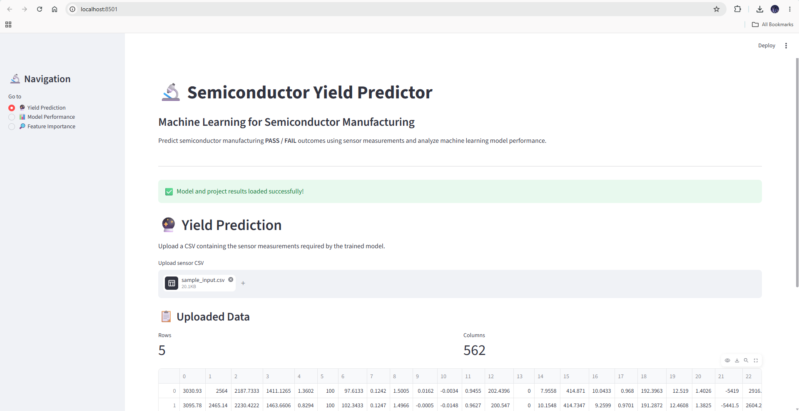

# 🔬 Semiconductor Yield Prediction

## 📌 Project Overview

This project uses Machine Learning to predict the Pass/Fail yield of a semiconductor manufacturing process using sensor measurements.

The project also investigates whether all available sensor features are required for building an effective prediction model.

---
## 🖥️ Application Preview



## 🎯 Objective

The main objectives are:

- Predict Pass/Fail yield of a semiconductor manufacturing process.
- Clean and preprocess sensor data.
- Analyze the sensor measurements statistically.
- Handle missing values.
- Handle class imbalance.
- Compare different Machine Learning models.
- Perform cross-validation.
- Apply GridSearch hyperparameter tuning.
- Identify important sensor features.
- Select and save the best-performing model.

---

## 📊 Dataset

The dataset contains:

- 1,567 production entities
- 591 sensor/process features
- 1 target column
- Target: `Pass/Fail`

Target encoding:

| Value | Meaning |
|---|---|
| `-1` | Pass |
| `1` | Fail |

The original dataset contains 592 columns in total.

---

## 🧹 Data Preprocessing

The following preprocessing steps were performed:

1. Removed the timestamp column.
2. Identified features with excessive missing values.
3. Removed features with more than 50% missing values.
4. Imputed remaining missing values using the median.
5. Separated predictors and target.
6. Converted the target:
   - `-1 → 0` (Pass)
   - `1 → 1` (Fail)
7. Performed stratified train-test splitting.
8. Standardized features where required.
9. Applied SMOTE only to the training data.

---

## 📈 Exploratory Data Analysis

The analysis includes:

### Univariate Analysis

- Feature distributions
- Histograms
- Boxplots
- Detection of potential outliers

### Bivariate Analysis

- Sensor features vs Pass/Fail
- Correlation with target
- Feature distribution comparison

### Multivariate Analysis

- Correlation matrix
- Sensor-to-sensor relationships
- Correlation heatmap

---

## 🤖 Machine Learning Models

Three supervised learning algorithms were evaluated:

### 1. Logistic Regression

Used as a baseline linear classification model.

### 2. Random Forest

An ensemble tree-based model capable of capturing nonlinear relationships.

### 3. Support Vector Machine

Used to identify complex decision boundaries between Pass and Fail classes.

---

## ⚙️ Model Optimization

The models were evaluated using:

- 5-fold Cross Validation
- GridSearchCV
- Hyperparameter tuning
- SMOTE
- Standardization
- Classification metrics

---

## 📊 Model Evaluation

The models were compared using:

- Training Accuracy
- Testing Accuracy
- Cross-Validation Accuracy
- ROC-AUC
- Precision
- Recall
- F1-score
- Confusion Matrix

The final model was selected based on its performance on unseen test data.

---

## 🔎 Feature Importance

Permutation Importance was used to identify sensor features that contribute most to model predictions.

This helps identify potentially important process signals associated with Pass/Fail yield.

---

## 🏆 Final Model

The best model is selected automatically based on the highest test accuracy obtained during model comparison.

The trained model is saved as:

```text
models/best_model.pkl
```

## 📊 Model Performance

Three machine learning models were trained and compared:

| Model | Test Accuracy |
|---|---:|
| Logistic Regression | 83.5% |
| Random Forest | 93.0% |
| SVM | 93.2% |

### Best Model

**SVM** achieved the highest test accuracy of approximately **93.2%** and was selected as the best-performing model.

The models were evaluated using training/test accuracy, cross-validation, classification reports, and ROC-AUC.

## 📝 Conclusion

The project successfully developed a machine learning pipeline for semiconductor manufacturing yield prediction.

The dataset was cleaned by removing highly incomplete features and handling remaining missing values. Exploratory data analysis was performed to understand feature relationships and target distribution.

Three classification models were trained and evaluated: Logistic Regression, Random Forest, and SVM. After comparing their performance, **SVM achieved the highest test accuracy of approximately 93.2%** and was selected as the best-performing model.

The project demonstrates how machine learning can be used to analyze semiconductor sensor data and predict manufacturing Pass/Fail outcomes.